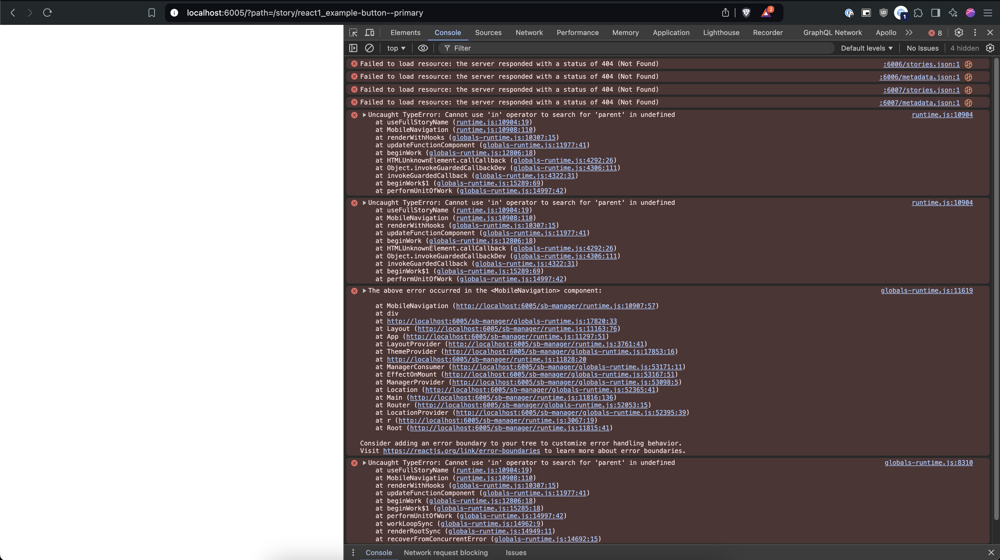

# Storybook composition bug

Storybook composition doesn't work properly on a screen width of less than 600px.

## How to test this?

1. Clone this repository
2. Install the dependencies
3. Run `npm run storybook`
4. Open the preview of any component
5. Resize your browser so that the window width is less than 600px

## Expected result

Storybook runs as expected and displays component preview

## Current result

Storybook shows a blank white page and throws errors from the storybook source code



## System info

```text
Storybook Environment Info:

  System:
    OS: macOS 14.6.1
    CPU: (10) arm64 Apple M1 Pro
    Shell: 5.9 - /bin/zsh
  Binaries:
    Node: 18.18.2 - ~/.nvm/versions/node/v18.18.2/bin/node
    npm: 9.8.1 - ~/.nvm/versions/node/v18.18.2/bin/npm <----- active
    pnpm: 9.7.0 - ~/Library/pnpm/pnpm
  Browsers:
    Chrome: 128.0.6613.119
    Safari: 17.6
  npmPackages:
    @storybook/addon-essentials: ^8.2.9 => 8.2.9
    @storybook/addon-links: ^8.2.9 => 8.2.9
    @storybook/blocks: ^8.2.9 => 8.2.9
    @storybook/react: ^8.2.9 => 8.2.9
    @storybook/react-vite: ^8.2.9 => 8.2.9
    @storybook/test: ^8.2.9 => 8.2.9
    eslint-plugin-storybook: ^0.8.0 => 0.8.0
    storybook: ^8.2.9 => 8.2.9
```
